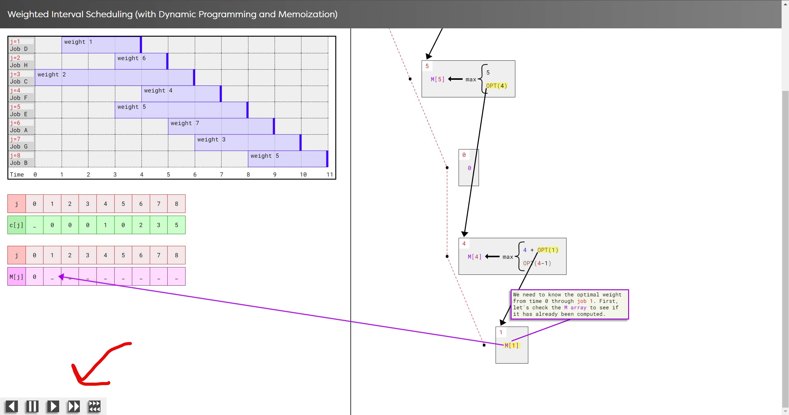

# Webimator

(Note: This README is a work in progress and does not currently give a suitable rundown of Webimator and its usage)

Webimator is a web animation framework that supports the development of interactive algorithm visualizations, providing a library of preset animations and  beginner-friendly API that can be used to animate DOM elements (i.e., the contents on a webpage which are produced by HTML code).

## Table of Contents

<!-- START doctoc generated TOC please keep comment here to allow auto update -->
<!-- DON'T EDIT THIS SECTION, INSTEAD RE-RUN doctoc TO UPDATE -->

- [Installation](#installation)
  - [Basic NPM Installation](#basic-npm-installation)
  - [First Time Installing a Package?](#first-time-installing-a-package)
    - [1. Install Node.js](#1-install-nodejs)
    - [2. Initialize a Project](#2-initialize-a-project)
    - [3. Install Webimator](#3-install-webimator)
- [Usage](#usage)
  - [Imports](#imports)
  - [Creating Animation Clips](#creating-animation-clips)
    - [Background](#background)
    - [Creation](#creation)
  - [Creating Animation Sequences](#creating-animation-sequences)
    - [Creating a Sequence and Adding Clips](#creating-a-sequence-and-adding-clips)
    - [Changing Sequential Timing of Clips](#changing-sequential-timing-of-clips)
  - [Creating Animation Timelines](#creating-animation-timelines)
    - [Creating a Timeline and Adding Sequences](#creating-a-timeline-and-adding-sequences)
    - [Adding Playback Buttons](#adding-playback-buttons)

<!-- END doctoc generated TOC please keep comment here to allow auto update -->

## Installation

### Basic NPM Installation

```bash
npm install webimator
```

### First Time Installing a Package?

(optional read)
<details>
  <summary>Expand/Collapse Section</summary>
  
A "package" is essentially a downloadable library of code that you can use alongside your _own_ code. For example, the animation framework Webimator is a package that can be downloaded using the command above, and you can use it with your code to help create your own animated visualizations.

Managing packages manually would be tedious since they are constantly being updated with new versions, deprecations, conflicts, etc. That is why it is common to install packages using a "package manager".

#### 1. Install Node.js

To install Webimator, you must use NPM (Node Package Manager). It is the package manager for Node.js, which is a runtime environment for JavaScript. NPM actually comes _with_ Node, so the first step to installing a package is to [install Node.js](https://nodejs.org/en/download/prebuilt-installer). After this, you can check to make sure Node and NPM are installed by opening any command-line interface (CLI) and running the following:

```bash
node --version
```
```bash
npm --version
```

#### 2. Initialize a Project

Now that Node is installed, you need to create a project. Create a folder (named whatever you want) and open it in any coding environment. I highly recommend [installing Visual Studio Code (VS Code)](https://code.visualstudio.com/download), which is a free feature-rich code editor. Next, open the terminal (the CLI for the coding environment) and run the following command:

```bash
npm init --yes
```

This will initialize a new Node project (do not worry about filling out all of the fields—the `--yes` flag tells it to just select default options. If you would actually like to fill them out manually, omit the `--yes` flag). A new file called `package.json` should now exist. This (along with a file you will soon see named `package-lock.json`) records important details about the project, including any dependencies (packages).

#### 3. Install Webimator

Now you can use the command given at the beginning of the [Installation section](#installation) (repeated here for convenience):

```bash
npm install webimator
```

NPM will install the specified package (in this case, `webimator`) as a "dependency". That means that the package is required for your code to work if you were to, say, publish your project online for users to look at.
</details>

## Usage

### Imports

Once Webimator is installed, import it with the following statements in your JavaScript code:
<!--MD-S id="import webimator" code-type="ts"-->
```ts
import { webimator } from 'webimator';
```
<!--MD-E id="import webimator"-->
For convenience (and clarity), the package also exposes a majority of its internal types and objects using other import paths (but none of them are required to make full usage of Webimator's functionalities):
<!--MD-S id="import paths" code-type="ts"-->
```ts
import * as WebimatorTypes from 'webimator/types-and-interfaces';
import * as WebimatorErrors from "webimator/error-handling";
import * as WebimatorEasing from "webimator/easing";
```
<!--MD-E id="import paths"-->

### Creating Animation Clips

#### Background

(optional read)
<details>
  <summary>Expand/Collapse Section</summary>

An "animation effect" is a predefined behavior that can be applied to elements. For example, an entrance animation effect called "fade-in" could be defined to cause an element to transition from 0% opacity to 100% opacity.

In Webimator, effects are grouped into 9 categories:
- Entrance effects
- Exit effects
- Emphasis effects
- Motion effects
- Transition effects
- Scroller effects
- Connector Setter effects
- Connector Entrance effects
- Connector Exit effects

To actually see an effect in action, you must play an **"animation clip"**. In the Webimator framework, a "clip" is the smallest building block of a timeline, represented by the class `AnimClip`. In essence, it is a [DOM element, effect] pair, where a "DOM element" is some HTML element on the page and the effect is the animation effect that will be applied to it. Since there are 9 categories of animation effects, there are 9 subclasses of `AnimClip`.

- `EntranceClip`
- `ExitClip`
- `EmphasisClip`
- `MotionClip`
- `TransitionClip`
- `ScrollerClip`
- `ConnectorSetterClip`
- `ConnectorEntranceClip`
- `ConnectorExitClip`
</details>

#### Creation

Webimator provides several factory functions that you can use to create animation clips (the smallest building block of a timeline, represented by the abstract `AnimClip` class). There is one factory function for each of the categories of clips (e.g., the `Entrance()` factory function returns `EntranceClip`, the `Motion()` factory function returns `MotionClip`, etc.). They are called "factory" functions because they create instances of clips without you having to deal with the more complex details of the constructors and setup.

To access the factory functions, use the `webimator` object's `createAnimationClipFactories()` method:
<!--MD-S id="usage__webimator.createAnimationClipFactories()" code-type="ts"-->
```ts
const clipFactories = webimator.createAnimationClipFactories();
```
<!--MD-E id="usage__webimator.createAnimationClipFactories()"-->
The properties of the object returned by `createAnimationClipFactories()` are the clip factory functions. You can now use them to create animation clips like in the following example:
<!--MD-S id="usage__create-basic-clips" code-type="ts"-->
```ts
const sqrEl = document.querySelector('.square');
const ent = clipFactories.Entrance(sqrEl, '~pinwheel', [2, 'clockwise']);
const ext = clipFactories.Exit(sqrEl, '~fade-out', [], {duration: 1500});
```
<!--MD-E id="usage__create-basic-clips"-->
In the example above, an element with the CSS class "square" is selected from the page, and it is targeted by two animation clips—an entrance clip and a motion clip. Generally, the effect name will always be followed by a tuple containing effect options. Evidently, the pinwheel effect accepts two effect options—the number of spins and the direction of the spin—while the fade out effect takes no effect options. After the effect options, you may specify a configuration object to set things like the duration, delay, end delay, CSS classes, playback rate, and other settings.

These animation clips are fully-fledged playback structures, and they can be played, rewound, paused, and more. However, as with normal JavaScript animations, outright playing multiple animation clips will run everything at the same time, which is likely not what you want.
<!--MD-S id="usage__badly-play-basic-clips" code-type="ts"-->
```ts
ent.play();
ext.play();
ext.rewind();
ent.rewind();
// ↑ AnimClip.prototype.play() and rewind() are asynchronous,
// so these will actually attempt to run all at the same time,
// ultimately causing an error
```
<!--MD-E id="usage__badly-play-basic-clips"-->

One way to manually control the timing of clips yourself is to use Promise-based syntax as in the code below. However, this would become unwieldly if there were dozens of animations, not to mention coordinating pauses, compensating for tiny errors in JavaScript's timing, etc.
<!--MD-S id="usage__play-basic-clips" code-type="ts"-->
```ts
// the entrance clip plays, and THEN the motion clip plays, and THEN the
// motion clip plays, and THEN the motion clip rewinds, and THEN the
// entrance clip rewinds
ent.play().then(() => {
  ext.play().then(() => {
    ext.rewind().then(() => {
      ent.rewind();
    })
  });
});

// exact same thing but using async/await syntax
(async function() {
  await ent.play();
  await ext.play();
  await ext.rewind();
  ent.rewind();
})();
```
<!--MD-E id="usage__play-basic-clips"-->
This is where the next playback structure—`AnimSequence`—comes in.

### Creating Animation Sequences

#### Creating a Sequence and Adding Clips

An **"animation sequence"** is a number of animations that occur one after another in a particular order. In Webimator, animation clips can be placed into sequences, which are their _own_ fully-fledged playback structures.

To create an animation sequence, use <!--MD-S id="usage__create-sequence" code-type="inline-code" MD-G-->`webimator.newSequence()`<!--MD-E-->. Without any arguments, the method just creates an empty sequence without any animation clips. You can add clips to the sequence upon its creation by passing a list of clips as arguments, or you can use <!--MD-S id="usage__add-clips" code-type="inline-code" MD-G-->`AnimSequence.prototype.addClips()`<!--MD-E-->:

<!--MD-S id="usage__create-sequence-clips" code-type="ts"-->
```ts
// get clip factory functions
const { Entrance, Exit, Motion } = webimator.createAnimationClipFactories();

// select elements from page
const sqrEl = document.querySelector('.square');
const circEl = document.querySelector('.circle');
const triEl = document.querySelector('.triangle');

// create animation clips
const enterSquare = Entrance(sqrEl, '~pinwheel', [2, 'clockwise']);
const enterCircle = Entrance(circEl, '~fade-in', []);

// create sequence with configuration options and animation clips
const seq = webimator.newSequence(
  // optional configuration object
  {playbackRate: 2, description: 'Enter all the shapes'},
  // 4 animation clips
  enterSquare,
  enterCircle,
  Entrance(triEl, '~fly-in', ['from-bottom-left']),
  Entrance(document.querySelector('.pentagon'), '~appear', []),
);

// add more clips to the sequence
seq.addClips(
  Motion(circEl, '~move-to', [sqrEl]),
  Exit(sqrEl, '~fade-out', []),
);

seq.play().then(() => seq.rewind());
```
<!--MD-E id="usage__create-sequence-clips"-->

In the example above, a new sequence is created with <!--MD-S id="usage__create-sequence" code-type="inline-code" MD-G-->`webimator.newSequence()`<!--MD-E -->. However, the first object passed to it is not an animation clip. You are actually allowed to pass a set of configuration options as the first argument to <!--MD-S id="usage__create-sequence" code-type="inline-code" MD-G-->`webimator.newSequence()`<!--MD-E--> and _then_ a list of clips (but if you do not want to set any configuration, you can just pass the list of clips only). Either way, the sequence contains four animation clips. Afterwards, two more clips are added to the sequence (for a total of six) using <!--MD-S id="usage__add-clips" code-type="inline-code" MD-G-->`AnimSequence.prototype.addClips()`<!--MD-E-->. Finally, the sequence is played and rewound. When playing, the animation clips will be played in order, each one starting _only_ after the previous one has finished. When rewinding, the clips are rewound in reverse order.

#### Changing Sequential Timing of Clips

Oftentimes, we actually _do_ want animation clips to play at the same time (in other words, play "in parallel"). To control this, there are two `AnimClip` configuration options that can be used to tell clips to play in parallel: <!--MD-S id="usage__starts-with-clip" code-type="inline-code" MD-G-->`startsWithPrevious`<!--MD-E--> and <!--MD-S id="usage__starts-next-clip" code-type="inline-code" MD-G-->`startsNextClipToo`<!--MD-E-->. Outside of a sequence, those options have absolutely no effect, but if the clips are part of a sequence, those options impact the timing of clips with respect to each other. Take a look at the example below.

<!--MD-S id="usage__sequencing-clips" code-type="ts"-->
```ts
// create sequence
const seq = webimator.newSequence(
  // optional configuration object
  {description: 'No one likes Pentagon!'},
  // 6 animation clips
  /** A */
  Entrance(sqrEl, '~fade-in', []), // A + 0ms
  Entrance(circEl, '~fade-in', [], {startsWithPrevious: true}), // A + 0ms
  Entrance(triEl, '~fade-in', [], {startsWithPrevious: true}), // A + 0ms
  /** B */
  Entrance(pentaEl, '~fly-in', ['from-left']), // B + 0ms
  /** C */
  Exit(circEl, '~fade-out', [], {startsNextClipToo: true}), // C + 0ms
  Exit(sqrEl, '~fade-out', [], {delay: 150, endDelay: 2}), // C + 150ms
  Exit(triEl, '~fade-out', [], {delay: 300, startsWithPrevious: true}), // C + 452ms (NOT C + 300ms!!!)
);

seq.play().then(() => seq.rewind());
```
<!--MD-E id="usage__sequencing-clips"-->

1. The first three entrance animation clips (labelled 'A') will play at the same time.
   - The second clip starts with the first, and the third clip starts with the second—therefore, all three play at the same time.
2. _After_ the third clip finishes, the fourth entrance clip (labelled 'B') plays on its own.
   - It has neither <!--MD-S id="usage__starts-with-clip" code-type="inline-code" MD-G-->`startsWithPrevious`<!--MD-E--> nor <!--MD-S id="usage__starts-next-clip" code-type="inline-code" MD-G-->`startsNextClipToo`<!--MD-E--> specified, and the clips adjacent to it (directly previous and directly next) do not have options that impact its timing either.
3. _After_ the fourth clip finishes, the three exit animation clips at the end (labelled C) begin at the same time.
   - The first exit tells the second exit to start and the third exit starts with the second exit.
   - However, because there are some `delay`s set, their starts are staggered. The comments describing the start times in milliseconds demonstrate how delays are stacked for clips playing in parallel.

### Creating Animation Timelines

#### Creating a Timeline and Adding Sequences

Visualizations are typically structured like slideshow presentations, where you must click or press some button to advance to the next step. That means that there needs to be a way to allow viewers to step forward and backward through your sequences in their browser. Suppose you have dozens of sequences that you want to coordinate. Just as `AnimSequence` serves as a container for `AnimClip`s, the timeline structure `AnimTimeline` serves as a container for `AnimSequence`s. Creating a timeline and adding sequences to it is straightforward.
<!--MD-S id="create-timeline" code-type="ts"-->
```ts
// get clip factory functions
const { Entrance, Exit, Motion } = webimator.createAnimationClipFactories();

// select elements from page
const sqrEl = document.querySelector('.square');
const circEl = document.querySelector('.circle');

// create sequences
const seq1 = webimator.newSequence(
  {jumpTag: 'ABC'},
  Entrance(sqrEl, '~fade-in', []),
  Entrance(circEl, '~fade-in', []),
);

const seq2 = webimator.newSequence(
  Motion(sqrEl, '~move-to', [circEl]),
  Exit(circEl, '~sink-down', [], {startsWithPrevious: true}),
);

const seq3 = webimator.newSequence(
  {autoplays: true},
  Exit(circEl, '~fade-out', []),
);

// create new timeline
const tLine = webimator.newTimeline(
  // optional config object
  {debugMode: true, timelineName: 'Basics'},
  // 3 sequences
  seq1,
  seq2,
  seq3,
);

// first step() plays seq1
tLine.step('forward')
  // second step() plays seq2, and then seq3 plays afterwards because seq3 has autoplay set
  .then(() => tLine.step('forward'))
  // instantly jumps back to right before seq1 (which has the 'tag' config set to "ABC")
  .then(() => tLine.jumpToSequenceTag('ABC'));
```
<!--MD-E id="create-timeline"-->

#### Adding Playback Buttons

Viewers will still need a way to step back and forth themselves in their browsers. For this, Webimator provides fully styled, out-of-the-box playback buttons that are automatically detected by a timeline. In the example above, notice how <!--MD-S id="usage__timeline" code-type="inline-code" MD-G-->`tLine`<!--MD-E-->'s `timelineName` config is set to <!--MD-S id="usage__timeline-name" code-type="inline-code" MD-G-->`'Basics'`<!--MD-E-->. In your HTML, you can use Webimator's custom playback button elements as shown below (the comments explain the process).

**HTML**
<!-- MD-S id="usage__body" code-type="html"-->
```html
<body>
  <main>
    <div class="square"></div>
    <div class="circle"></div>
    <div class="triangle"></div>
    <div class="pentagon"></div>
  </main>
  <!-- The timeline-name attribute must match the timeline object's timelineName config value. -->
  <div class="buttons" timeline-name="Basics">
    <!-- Webimator playback button components will be automatically linked to timeline. -->
    <!-- action attribute controls what button it is. Optional shortcut attribute increases accessibility. -->
    <wbmtr-playback-button action="step-backward" shortcut="ArrowLeft"></wbmtr-playback-button>
    <wbmtr-playback-button action="pause" shortcut="Space"></wbmtr-playback-button>
    <wbmtr-playback-button action="step-forward" shortcut="ArrowRight"></wbmtr-playback-button>
    <wbmtr-playback-button action="fast-forward" shortcut="F" trigger="hold"></wbmtr-playback-button>
    <wbmtr-playback-button action="toggle-skipping" shortcut="S"></wbmtr-playback-button>
    <!--
     Note: If the element containing the buttons does not specify timeline-name, each button must specify timeline-name,
     so it is best to just specify it on the parent element like in this example to avoid repetition and mistakes)
    -->
  </div>
</body>
```
<!-- MD-E id="usage__body"-->
**CSS**
<!-- MD-S id="buttons-container-style" code-type="css"-->
```css
/** We recommend fixing the container holding the buttons to some corner of the screen */
.buttons {
  position: fixed;
  bottom: 0;
  left: 0;
  background-color: #dddddd;
  padding: 2rem 1rem;
  transform-origin: bottom left;
}
```
<!-- MD-E id="buttons-container-style"-->
With just that code (which you can feel free to copy and paste—just change the `timeline-name` attribute to match your timeline), your visualization will display playback buttons that look like the ones shown in the image below. Creating your _own_ buttons from scratch that attempt to interface with `AnimTimeline` is _not_ recommended.


<!-- ### Creating Custom Preset Animation Effects

Sometimes, you will need an animation effect that Webimator does not exactly have. -->

(Work in progress)
